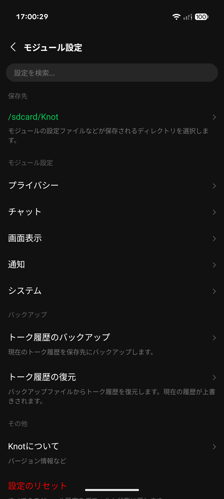
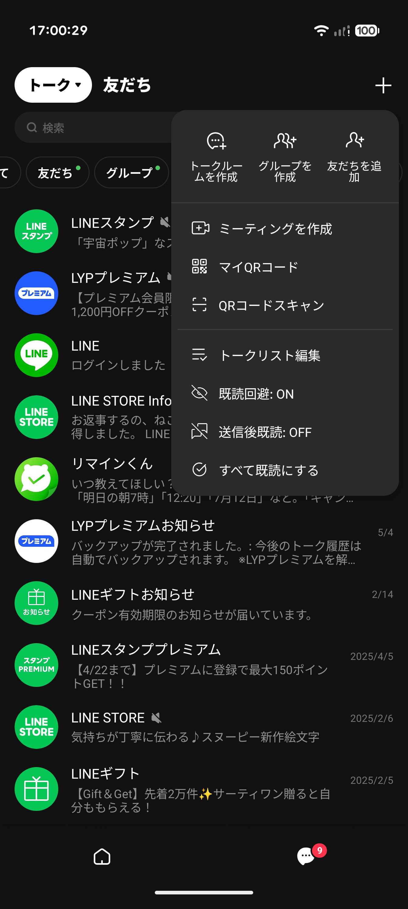
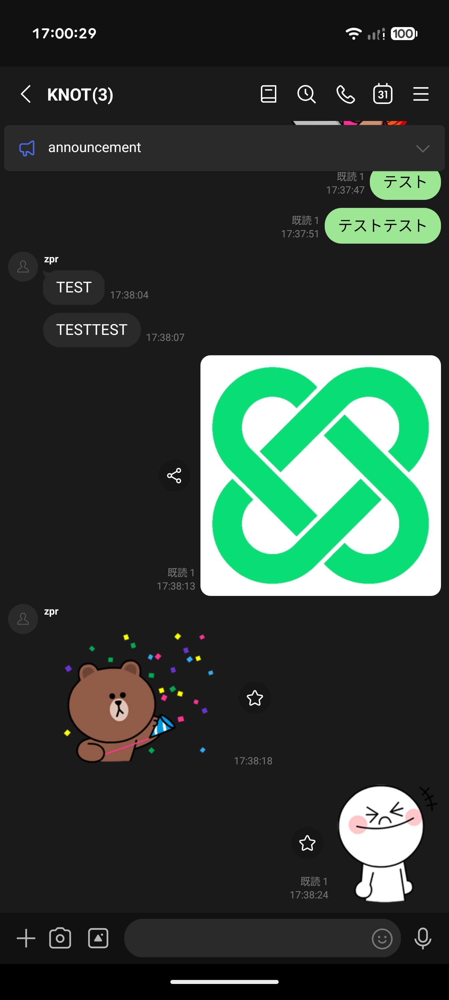
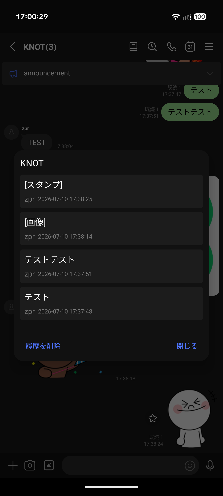
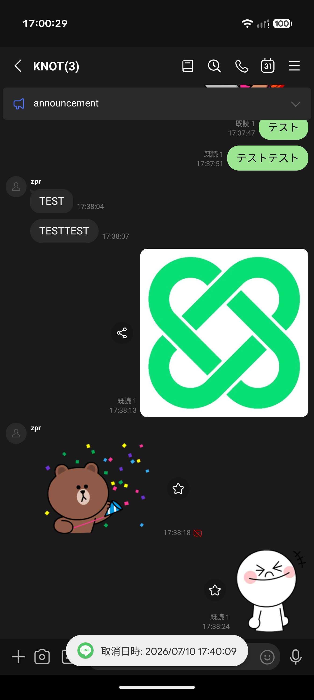
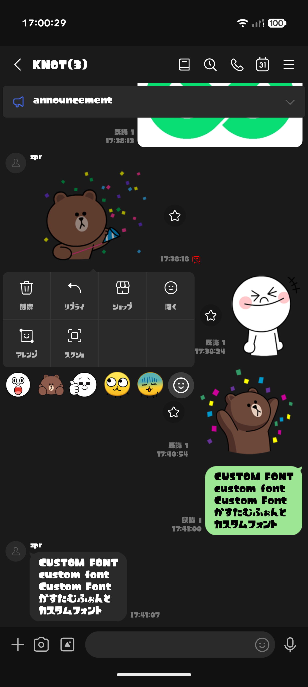

# Knot - Xposed module for LINE

[日本語](README.md) | [English](README.en.md) | **繁體中文**

  
  
  
  
  

Knot是一款開發中的Xposed模組，旨在提升Android版LINE的使用體驗。

> ⚠️本模組由個人以學習為目的所開發，與LY Corporation沒有任何關係。使用本模組可能違反LINE的服務條款，對於因使用本模組而導致的帳號受限、停權、資料遺失等任何不利影響或損害，開發者概不負責。請自行承擔使用風險。

**支援的LINE版本**：26.10.0, 26.10.1, 26.11.0, 26.13.0, 26.13.1, 26.14.0

**支援的語言**：日本語, English, 繁體中文

## 螢幕截圖

  
  
  

  
  
  

## 主要功能

### 隱私與訊息
- **避免已讀／已讀記錄**：閱讀訊息時不會顯示已讀，只有在回覆時才標示為已讀。此外也會記錄誰在何時已讀了訊息。
- **停用訊息收回／延長收回時限**：即使對方收回訊息，訊息仍會保留在你的裝置上；你自己可收回訊息的時限也會延長至24小時。
- **以預設瀏覽器開啟連結**：以系統的預設瀏覽器開啟網址，而非應用程式內建瀏覽器。
- **解除照片與影片的傳送限制**：略過傳送時的自動壓縮與縮放，以最高品質傳送，並可傳送5分鐘以上的影片。
- **強化聊天室內搜尋**：可依成員篩選搜尋結果，也能只用1個字搜尋聊天內容。
- **聊天畫面介面改善**：隱藏AI圖示，並在時間顯示中加入秒數。

### 畫面顯示與介面
- **隱藏廣告與推薦**：隱藏聊天清單與主頁畫面上的各種廣告、推薦內容及服務清單。
- **自訂分頁**：可隱藏VOOM、新聞／通話、應用程式等不需要的分頁及圖示下方的標籤，並擴大分頁的點擊範圍。
- **移除不需要的按鈕**：移除聊天分頁右上角的「AI Friends」、「OpenChat」按鈕，以及搜尋列旁等處的「Agent i」相關介面。
- **自訂字型**：可將你喜歡的TTF/OTF字型檔套用至整個應用程式。

### 通知
- **表情貼通知**：訊息收到表情貼回應時，會以通知告知你。
- **隱藏「關閉通知」按鈕**：移除通知中顯示的「關閉通知」按鈕。
- **自訂通話鈴聲**：可將LINE通話的來電鈴聲換成任意音訊檔，或停用對方設定的來電答鈴，改播預設答鈴。
- **改善通知延遲或收不到的問題（FCM Fix）**：為了避免在非Root環境下收不到通知，會將FCM接收處理直接交給服務，並可讓LINE常駐為前景服務。

## 安裝方式

  
  &nbsp;&nbsp;
  

### Root環境

1. 安裝與API 102相容的Xposed框架，例如[Vector](https://github.com/JingMatrix/Vector/releases)。
2. 安裝[Knot](https://github.com/2b-zipper/Knot/releases/latest)，並在管理器中啟用模組。
3. 將LINE設為作用域（目標應用程式）。
4. 重新啟動LINE，然後在Knot的模組設定中啟用各項功能。
   * 開啟模組設定的方法：長按主頁分頁右上角的設定按鈕，或從LINE設定中由Knot新增的項目開啟。

### 非Root環境
**！！！安裝前請務必備份聊天記錄！！！**

#### 1. 事前準備
1. 安裝[Fork版的NPatch](https://github.com/Nich87/NPatch)。
2. 安裝[MicroG-RE](https://github.com/MorpheApp/MicroG-RE)。
3. 開啟MicroG-RE，點擊`忽略最佳化`以停用電池最佳化。接著開啟`手動檢查`項目，並允許畫面上顯示的所有權限。
4. 開啟MicroG-RE的`帳戶`項目，使用備份聊天記錄時所用的Google帳戶登入。

#### 2. 修補與安裝
5. 開啟NPatch，設定儲存空間存取權限與要使用的資料夾。
6. 從NPatch主畫面的版本清單下載並安裝最新版的Knot。
7. 點擊`開始打包`按鈕，選擇修補方式。
   > 建議選擇`Download and Patch from Cloud Proxy`（從代理伺服器下載並修補）。若要自行從APKMirror等網站下載，請下載Knot支援的版本再進行修補。
8. 選擇LINE的版本或APK後，點擊右下角的`開始打包`按鈕開始修補。
9. 修補完成後，點擊右下角的`安裝`按鈕進行安裝。
   > 若已安裝Shizuku，將會自動安裝。

#### 3. 初始設定與還原聊天記錄
10. 啟動LINE並登入。
    > 請略過還原聊天記錄時選擇Google帳戶的畫面。
11. 點擊LINE主頁上顯示的橫幅，設定Knot要使用的目錄；接著長按主頁右上角的設定按鈕，開啟Knot的模組設定。
12. 啟用「通知」中的`FCM Fix`，然後重新啟動LINE。
13. 在LINE設定中開啟`備份及復原聊天記錄`，點擊`復原`並選擇Google帳戶，即可還原聊天記錄。
14. 在Knot的模組設定中啟用各項功能。
    * 開啟模組設定的方法：長按主頁分頁右上角的設定按鈕，或從LINE設定中由Knot新增的項目開啟。

## 版本類型

<table>
  <tr>
    <td><b>Release（穩定版）</b></td>
    <td>經過充分測試，確認可穩定運作的版本。 <b>※一般情況下請使用此版本。</b></td>
  </tr>
  <tr>
    <td><b>RC（發布候選版）</b></td>
    <td>正式發布前進行最終確認用的版本。 比Beta版穩定，但仍可能殘留問題。</td>
  </tr>
  <tr>
    <td><b>Beta（測試版）</b></td>
    <td>用於測試新功能與錯誤修正的版本。 可能含有預期之外的問題。</td>
  </tr>
</table>

## 開發者

- [2b-zipper](https://github.com/2b-zipper)
- [Nich87](https://github.com/Nich87)

## 授權條款

本專案以[GNU GPLv3](LICENSE)授權公開。

依據GPLv3授權條款，你可以自由複製、修改及再散布本專案的程式碼；但若要散布使用或修改了這些程式碼的成果，**必須公開原始碼，並以相同的GPLv3授權條款公開**。禁止在未公開原始碼的情況下，擅自挪用或轉載本專案的程式碼並加以散布。
